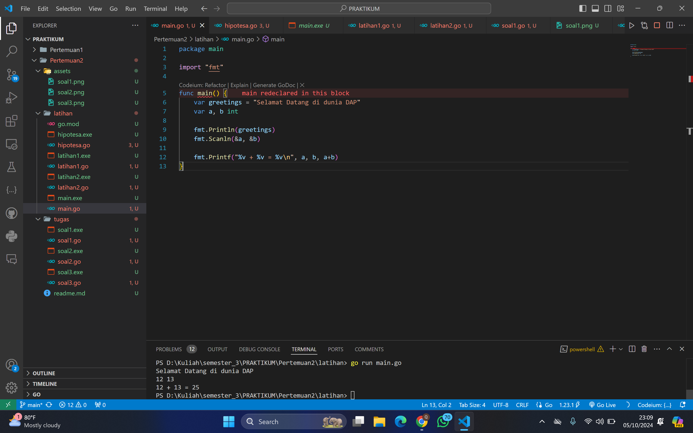
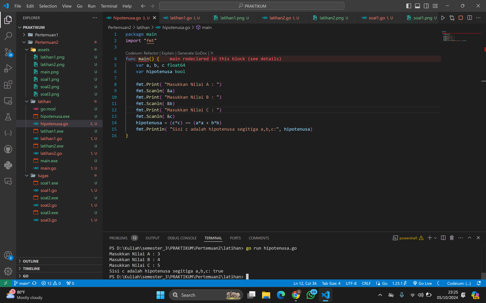
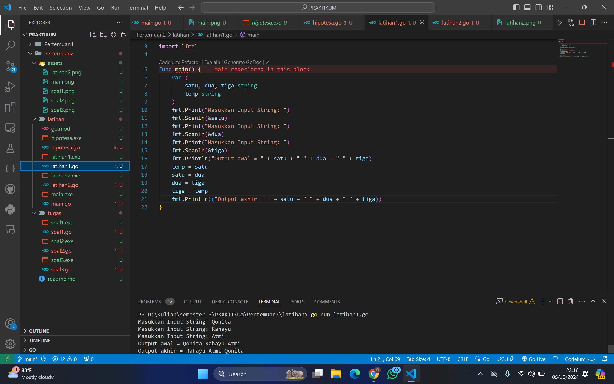
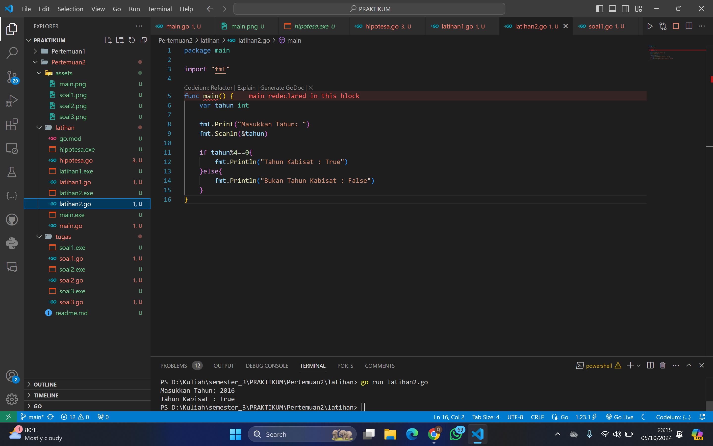
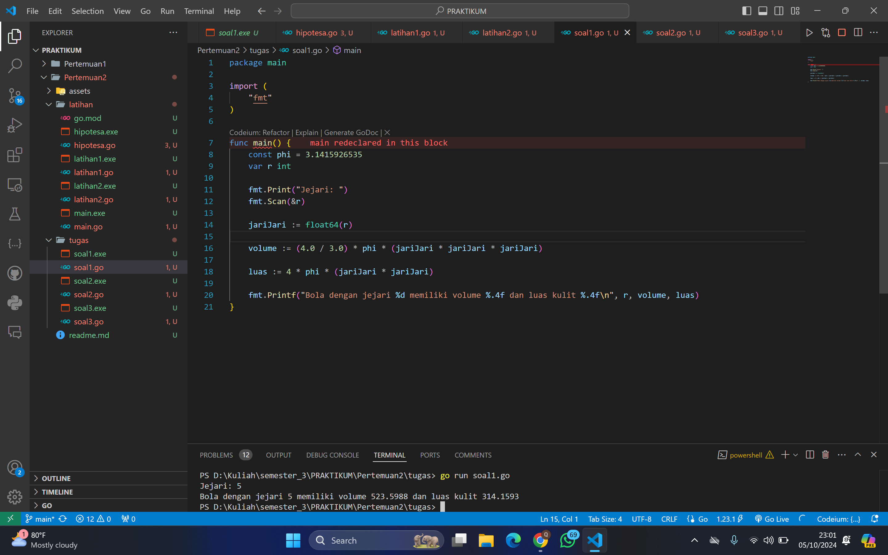
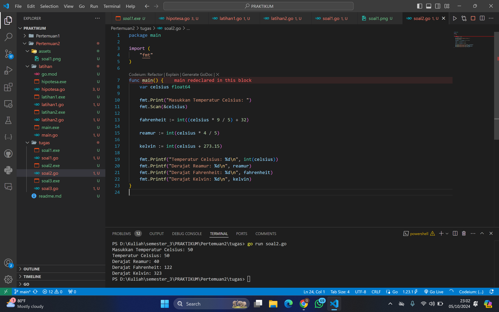
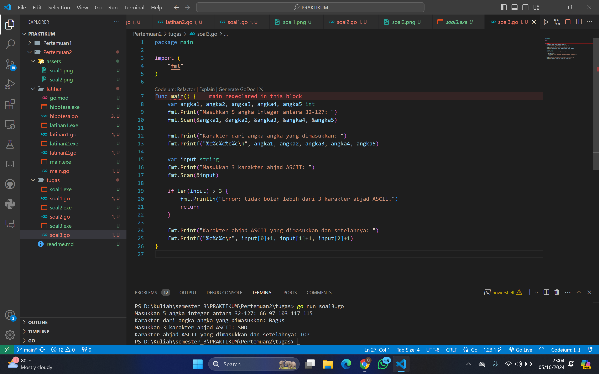

# <h1 align="center">Laporan Praktikum Modul 2</h1>


<h1 align="center">QONITA RAHAYU ATMI-2311102128</h1>

A. Soal Latihan

### 1. main

```go
package main

import "fmt"

func main() {
	var greetings = "Selamat Datang di dunia DAP"
	var a, b int

	fmt.Println(greetings)
	fmt.Scanln(&a, &b)

	fmt.Printf("%v + %v = %v\n", a, b, a+b)
}
```

### Output Screenshot:



### 2. Hipotenusa

```go
package main
import "fmt"

func main() {
	var a, b, c float64
	var hipotenusa bool

	fmt.Print( "Masukkan Nilai A : ")
	fmt.Scanln( &a)
	fmt.Print( "Masukkan Nilai B : ")
	fmt.Scanln( &b)
	fmt.Print( "Masukkan Nilai C : ")
	fmt.Scanln( &c)
	hipotenusa = (c*c) == (a*a + b*b)
	fmt.Println( "Sisi c adalah hipotenusa segitiga a,b,c:", hipotenusa)
}
```

### Output Screenshot:



### 3. Latihan 1

```go
package main

import "fmt"

func main() {
	var (
		satu, dua, tiga string
		temp string
	)
	fmt.Print("Masukkan Input String: ")
	fmt.Scanln(&satu)
	fmt.Print("Masukkan Input String: ")
	fmt.Scanln(&dua)
	fmt.Print("Masukkan Input String: ")
	fmt.Scanln(&tiga)
	fmt.Println("Output awal = " + satu + " " + dua + " " + tiga)
	temp = satu
	satu = dua
	dua = tiga
	tiga = temp
	fmt.Println(("Output akhir = " + satu + " " + dua + " " + tiga))
}
```

### Output Screenshot:



### 2. Latihan 2

```go
package main

import "fmt"

func main() {
	var tahun int

	fmt.Print("Masukkan Tahun: ")
	fmt.Scanln(&tahun)

	if tahun%4==0{
		fmt.Println("Tahun Kabisat : True")
	}else{
		fmt.Println("Bukan Tahun Kabisat : False")
	}
}
```

### Output Screenshot:




B. Tugas

### 1. Soal 1

```go
package main

import (
	"fmt"
)

func main() {
	const phi = 3.1415926535
	var r int

	fmt.Print("Jejari: ")
	fmt.Scan(&r)

	jariJari := float64(r)

	volume := (4.0 / 3.0) * phi * (jariJari * jariJari * jariJari)

	luas := 4 * phi * (jariJari * jariJari)

	fmt.Printf("Bola dengan jejari %d memiliki volume %.4f dan luas kulit %.4f\n", r, volume, luas)
}
```

### Output Screenshot:



### 2. Soal 2

```go
package main

import (
	"fmt"
)

func main() {
	var celsius float64

	fmt.Print("Masukkan Temperatur Celsius: ")
	fmt.Scan(&celsius)

	fahrenheit := int((celsius * 9 / 5) + 32)

	reamur := int(celsius * 4 / 5)

	kelvin := int(celsius + 273.15)

	fmt.Printf("Temperatur Celsius: %d\n", int(celsius))
	fmt.Printf("Derajat Reamur: %d\n", reamur)
	fmt.Printf("Derajat Fahrenheit: %d\n", fahrenheit)
	fmt.Printf("Derajat Kelvin: %d\n", kelvin)
}

```

### Output Screenshot:



### 3. Soal 3

```go
package main

import (
	"fmt"
)

func main() {
	var angka1, angka2, angka3, angka4, angka5 int
	fmt.Print("Masukkan 5 angka integer antara 32-127: ")
	fmt.Scan(&angka1, &angka2, &angka3, &angka4, &angka5)

	fmt.Print("Karakter dari angka-angka yang dimasukkan: ")
	fmt.Printf("%c%c%c%c%c\n", angka1, angka2, angka3, angka4, angka5)

	var input string
	fmt.Print("Masukkan 3 karakter abjad ASCII: ")
	fmt.Scan(&input)

	if len(input) > 3 {
		fmt.Println("Error: tidak boleh lebih dari 3 karakter abjad ASCII.")
		return
	}

	fmt.Print("Karakter abjad ASCII yang dimasukkan dan setelahnya: ")
	fmt.Printf("%c%c%c\n", input[0]+1, input[1]+1, input[2]+1)
}
```

### Output Screenshot:


