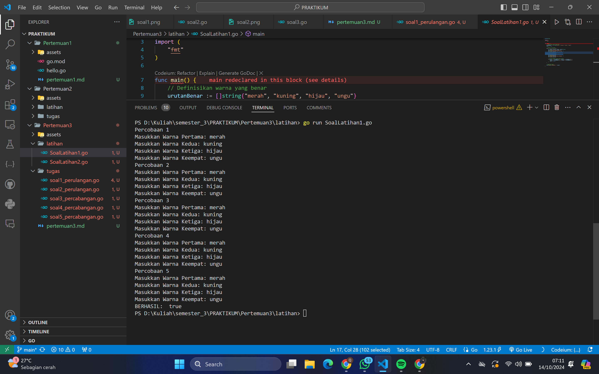
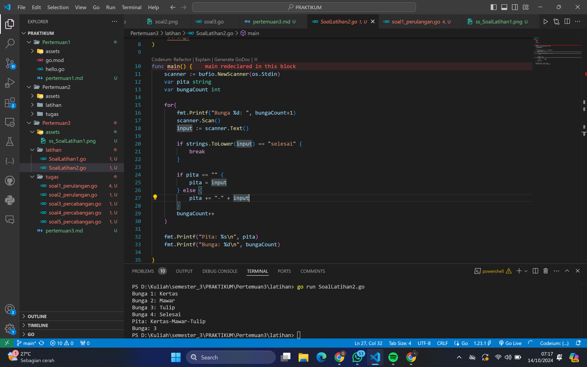
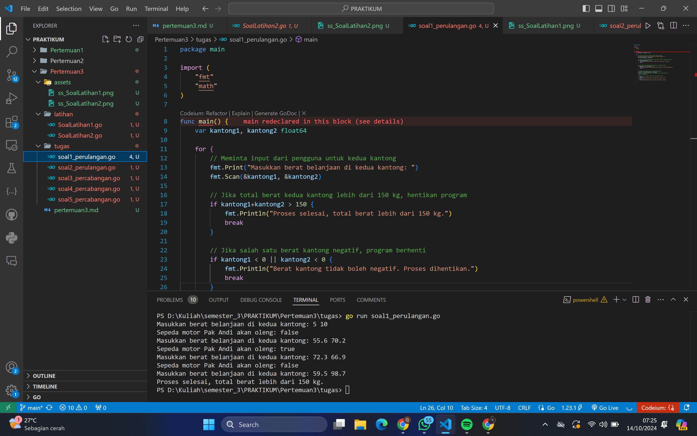
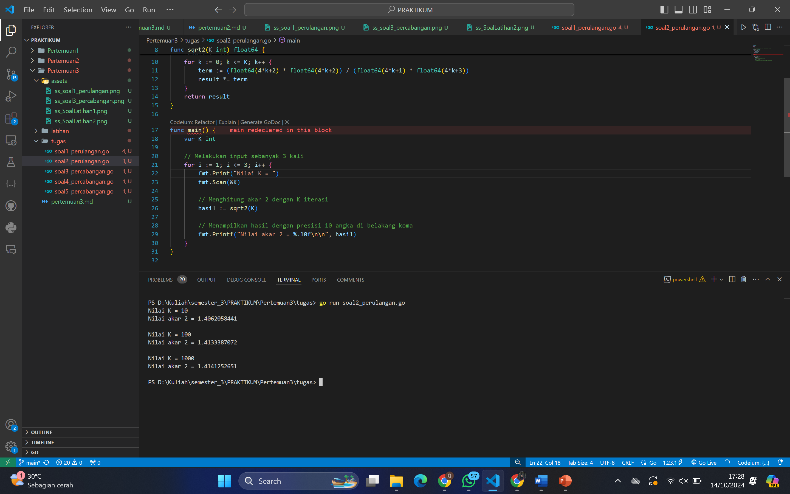
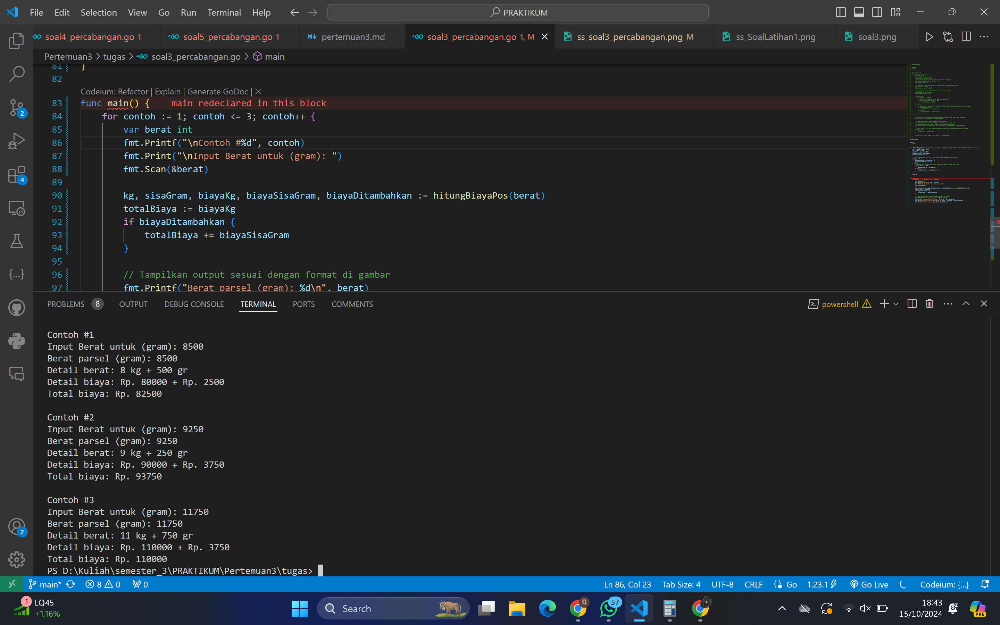
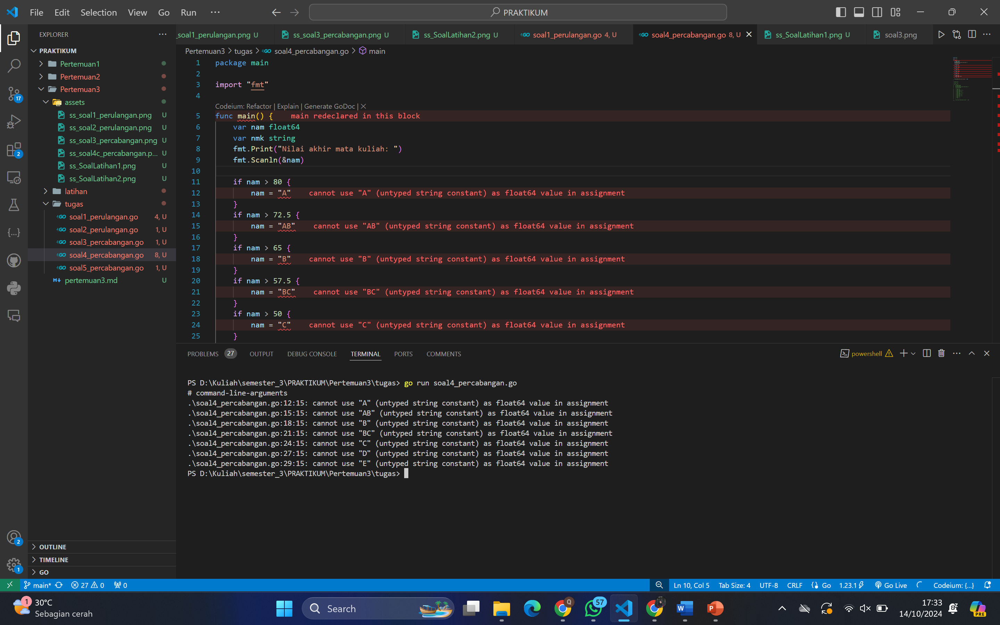
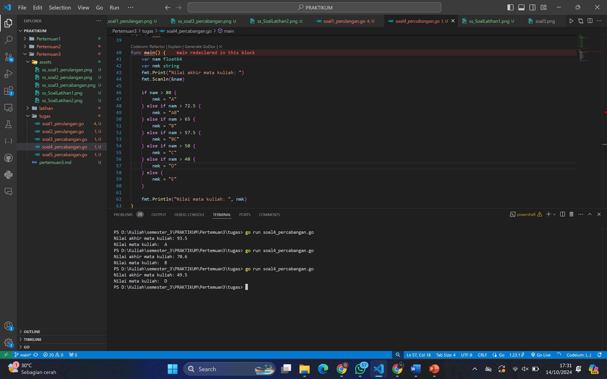
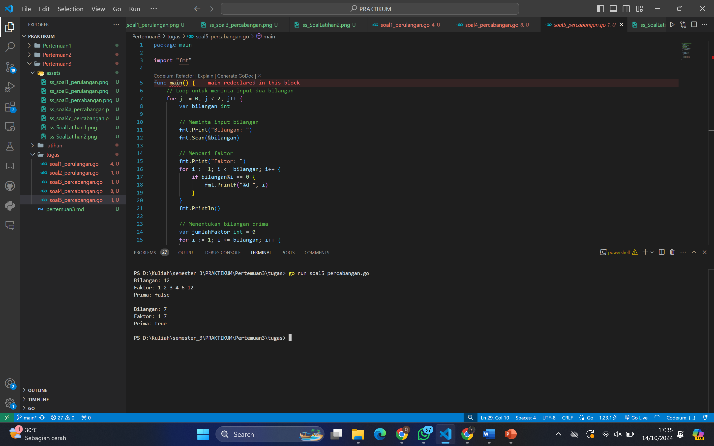

# <h1 align="center">Laporan Praktikum Modul 3-Perulangan & Percabangan</h1>

<h1 align="center">QONITA RAHAYU ATMI-2311102128</h1>

<h1>A. Soal Latihan</h1>

### 1. Soal Latihan 1

```go
package main

import (
	"fmt"
)

func main() {
	// Definisikan warna yang benar
	urutanBenar := []string{"merah", "kuning", "hijau", "ungu"}
	hasil := true

	//Lakukan 5 percobaan
	for i := 1; i <= 5; i++ {
		var warna1, warna2, warna3, warna4 string
		fmt.Printf("Percobaan %d\n", i)
		fmt.Print("Masukkan Warna Pertama: ")
		fmt.Scanln(&warna1)
		fmt.Print("Masukkan Warna Kedua: ")
		fmt.Scanln(&warna2)
		fmt.Print("Masukkan Warna Ketiga: ")
		fmt.Scanln(&warna3)
		fmt.Print("Masukkan Warna Keempat: ")
		fmt.Scanln(&warna4)

		// Periksa apakah urutan warna sesuai
		if warna1 != urutanBenar[0] || warna2 != urutanBenar[1] ||
			warna3 != urutanBenar[2] || warna4 != urutanBenar[3] {
			hasil = false
		}
	}

	//Tampilkan hasil
	fmt.Println("BERHASIL: ", hasil)
}
```

### Output Screenshot:



### 2. Soal Latihan 2

```go
package main

import (
	"bufio"
	"fmt"
	"os"
	"strings"
)

func main() {
	scanner := bufio.NewScanner(os.Stdin)
	var pita string
	var bungaCount int

	for{
		fmt.Printf("Bunga %d: ", bungaCount+1)
		scanner.Scan()
		input := scanner.Text()

		if strings.ToLower(input) == "selesai" {
			break
		}

		if pita == "" {
			pita = input
		} else {
			pita += "-" + input
		}
		bungaCount++
	}

	fmt.Printf("Pita: %s\n", pita)
	fmt.Printf("Bunga: %d\n", bungaCount)

}
```

### Output Screenshot:



<h1>B. Tugas</h1>

### 1. Tugas Soal 1 Perulangan

```go
package main

import (
	"fmt"
	"math"
)

func main() {
	var kantong1, kantong2 float64

	for { 
		// Meminta input dari pengguna untuk kedua kantong
		fmt.Print("Masukkan berat belanjaan di kedua kantong: ")
		fmt.Scan(&kantong1, &kantong2)

		// Jika total berat kedua kantong lebih dari 150 kg, hentikan program
		if kantong1+kantong2 > 150 {
			fmt.Println("Proses selesai, total berat lebih dari 150 kg.")
			break 
		}

		// Jika salah satu berat kantong negatif, program berhenti
		if kantong1 < 0 || kantong2 < 0 {
			fmt.Println("Berat kantong tidak boleh negatif. Proses dihentikan.")
			break 
		}

		// Menghitung selisih berat antara kedua kantong
		selisih := math.Abs(kantong1 - kantong2)
		// Mengecek apakah selisih berat lebih dari atau sama dengan 9
		oleng := selisih >= 9 

		// Output hasil apakah sepeda akan oleng atau tidak
		if oleng {
			fmt.Println("Sepeda motor Pak Andi akan oleng: true")
		} else {
			fmt.Println("Sepeda motor Pak Andi akan oleng: false")
		}
	}
}

```

### Output Screenshot:




### 2. Tugas Soal 2 Perulangan

```go
package main

import (
	"fmt"
)

// Fungsi untuk menghitung akar dari 2 berdasarkan rumus di gambar
func sqrt2(K int) float64 {
	result := 1.0
	for k := 0; k <= K; k++ {
		term := (float64(4*k+2) * float64(4*k+2)) / (float64(4*k+1) * float64(4*k+3))
		result *= term
	}
	return result
}

func main() {
	var K int

	// Melakukan input sebanyak 3 kali
	for i := 1; i <= 3; i++ {
		fmt.Print("Nilai K = ")
		fmt.Scan(&K)

		// Menghitung akar 2 dengan K iterasi
		hasil := sqrt2(K)

		// Menampilkan hasil dengan presisi 10 angka di belakang koma
		fmt.Printf("Nilai akar 2 = %.10f\n\n", hasil)
	}
}
```

### Output Screenshot:




### 3. Tugas Soal 3 Percabangan

```go
package main

import (
	"fmt"
)

func hitungBiayaPos(berat int) (kg, sisaGram, biayaKg, biayaSisaGram int, biayaDitambahkan bool) {
	const biayaPerKg = 10000
	kg = berat / 1000
	sisaGram = berat % 1000
	biayaKg = kg * biayaPerKg
	biayaDitambahkan = true 

	// jika berat total >= 10kg, sisa gram tidak menambah biaya total
	if kg >= 10 {
		biayaSisaGram = sisaGram * 5
		biayaDitambahkan = false    
	} else {
		// menghitung biaya untuk sisa gram jika berat kurang dari 10kg
		if sisaGram >= 500 {
			biayaSisaGram = sisaGram * 5
		} else {
			biayaSisaGram = sisaGram * 15
		}
	}
	return
}

func main() {
	for contoh := 1; contoh <= 3; contoh++ {
		var berat int
		fmt.Printf("\nContoh #%d", contoh)
		fmt.Print("\nInput Berat untuk (gram): ")
		fmt.Scan(&berat)

		kg, sisaGram, biayaKg, biayaSisaGram, biayaDitambahkan := hitungBiayaPos(berat)
		totalBiaya := biayaKg
		if biayaDitambahkan {
			totalBiaya += biayaSisaGram
		}

		// Tampilkan output sesuai dengan format di gambar
		fmt.Printf("Berat parsel (gram): %d\n", berat)
		fmt.Printf("Detail berat: %d kg + %d gr\n", kg, sisaGram)
		fmt.Printf("Detail biaya: Rp. %d + Rp. %d\n", biayaKg, biayaSisaGram)
		fmt.Printf("Total biaya: Rp. %d\n", totalBiaya)
	}
}
```

### Output Screenshot:




### 4. Soal Latihan 4a Percabangan

```go
package main

import "fmt"

func main() {
    var nam float64
    var nmk string
    fmt.Print("Nilai akhir mata kuliah: ")
    fmt.Scanln(&nam)
    
    if nam > 80 {
        nam = "A"
    }
    if nam > 72.5 {
        nam = "AB"
    }
    if nam > 65 {
        nam = "B"
    }
    if nam > 57.5 {
        nam = "BC"
    }
    if nam > 50 {
        nam = "C"
    }
    if nam > 40 {
        nam = "D"
    } else if nam <= 40 {
        nam = "E"
    }
    
    fmt.Println("Nilai mata kuliah: ", nmk)
}
```

### Output Screenshot:



Jawab: Tidak karena program tidak bisa berjalan

### 5. Soal Latihan 4b Percabangan

- Kesalahan dari Program

1. Penggunaan variabel yang salah atau kurang tepat:

Pada kode asli, variabel nam digunakan untuk menyimpan nilai akhir kuliah dalam bentuk angka, tetapi variabel yang dimodifikasi menjadi nilai huruf juga adalah nam. Hal ini salah karena nam seharusnya menyimpan nilai angka, dan variabel baru (misalnya nmk) harus menyimpan nilai huruf. Kode tersebut terdapat kesalahan pada penulisan di mana setelah membandingkan nilai angka, variabel yang digunakan untuk nilai huruf harusnya berbeda dengan variabel nilai angka (nam).

2. Penggunaan percabangan yang tidak efisien:

Pada kode asli, semua kondisi menggunakan if terpisah, sehingga setiap blok kondisi akan dieksekusi meskipun kondisi sebelumnya sudah terpenuhi. Ini menyebabkan program selalu memeriksa semua kondisi walaupun hasilnya sudah diketahui di awal. Sebaiknya menggunakan else if untuk menghindari pemeriksaan yang tidak perlu.

- Mengapa code kurang tepat?

Penggunaan variabel yang benar sangat penting agar kode dapat dibaca dan dipahami dengan jelas. Selain itu, modifikasi variabel yang tidak sesuai dapat menyebabkan hasil yang tidak diinginkan. Dalam hal ini, nam sebagai nilai numerik tidak boleh diubah menjadi string tanpa variabel terpisah. Struktur kondisi yang efisien (else if) membuat kode lebih cepat dan hemat sumber daya, karena program akan berhenti mengecek kondisi setelah satu kondisi terpenuhi.

- Alur Program
1. Program meminta input berupa nilai akhir mata kuliah (dalam bentuk angka).
2. Berdasarkan nilai yang diinputkan, program akan menentukan grade atau nilai huruf yang sesuai dengan rentang nilai yang telah ditetapkan.
3. Program menggunakan struktur kondisi yang efisien (if dan else if) untuk membandingkan nilai yang diinputkan.
4. Setelah kondisi terpenuhi, program menyimpan nilai huruf tersebut dalam variabel nmk.
5. Program kemudian mencetak hasil nilai mata kuliah dalam bentuk huruf yang telah disimpan di variabel nmk.

### 6. Soal Latihan 4c Percabangan

```go
package main

import "fmt"

func main() {
    var nam float64
    var nmk string
    fmt.Print("Nilai akhir mata kuliah: ")
    fmt.Scanln(&nam)

    if nam > 80 {
        nmk = "A"
    } else if nam > 72.5 {
        nmk = "AB"
    } else if nam > 65 {
        nmk = "B"
    } else if nam > 57.5 {
        nmk = "BC"
    } else if nam > 50 {
        nmk = "C"
    } else if nam > 40 {
        nmk = "D"
    } else {
        nmk = "E"
    }

    fmt.Println("Nilai mata kuliah: ", nmk)
}
```

### Output Screenshot:




### 7. Soal Latihan 5 Percabangan

```go
package main

import "fmt"

func main() {
    // Loop untuk meminta input dua bilangan
    for j := 0; j < 2; j++ {
        var bilangan int

        // Meminta input bilangan
        fmt.Print("Bilangan: ")
        fmt.Scan(&bilangan)

        // Mencari faktor
        fmt.Print("Faktor: ")
        for i := 1; i <= bilangan; i++ {
            if bilangan%i == 0 {
                fmt.Printf("%d ", i)
            }
        }
        fmt.Println()

        // Menentukan bilangan prima
        var jumlahFaktor int = 0
        for i := 1; i <= bilangan; i++ {
            if bilangan%i == 0 {
                jumlahFaktor++
            }
        }

        if jumlahFaktor == 2 {
            fmt.Println("Prima: true")
        } else {
            fmt.Println("Prima: false")
        }

        fmt.Println() 
    }
}
```

### Output Screenshot:


