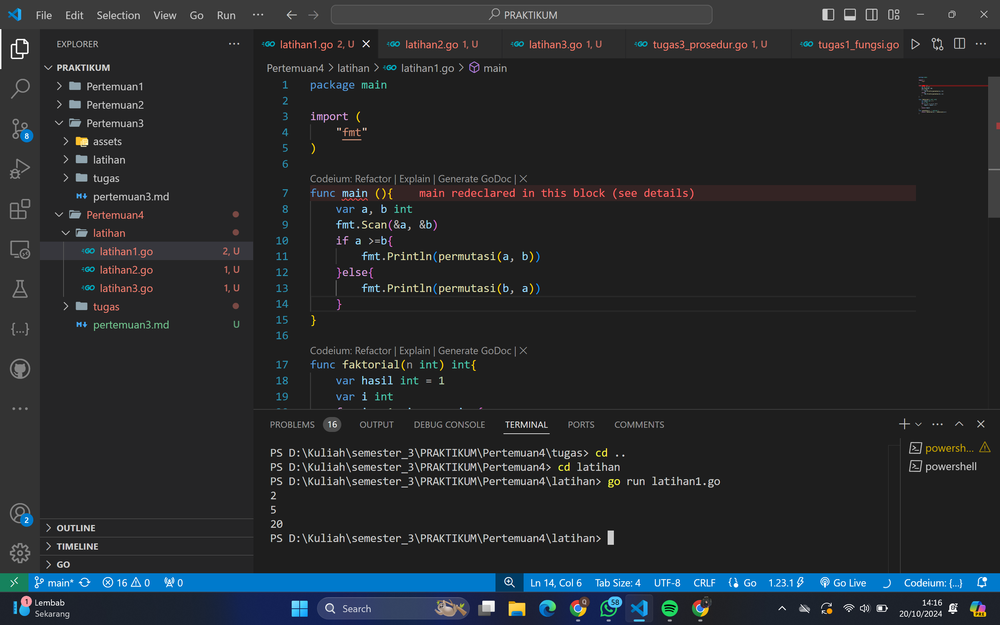
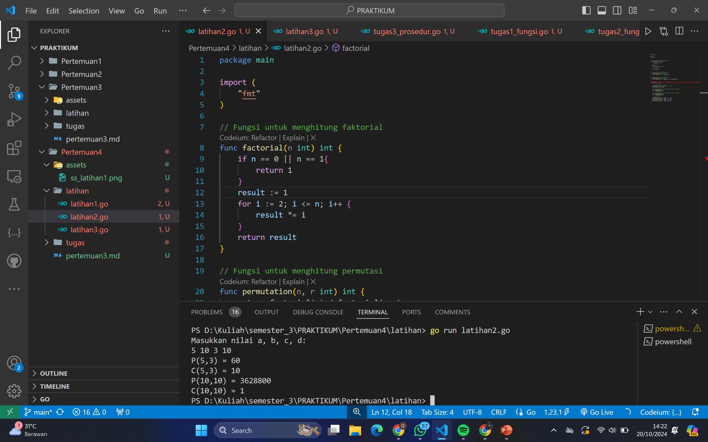
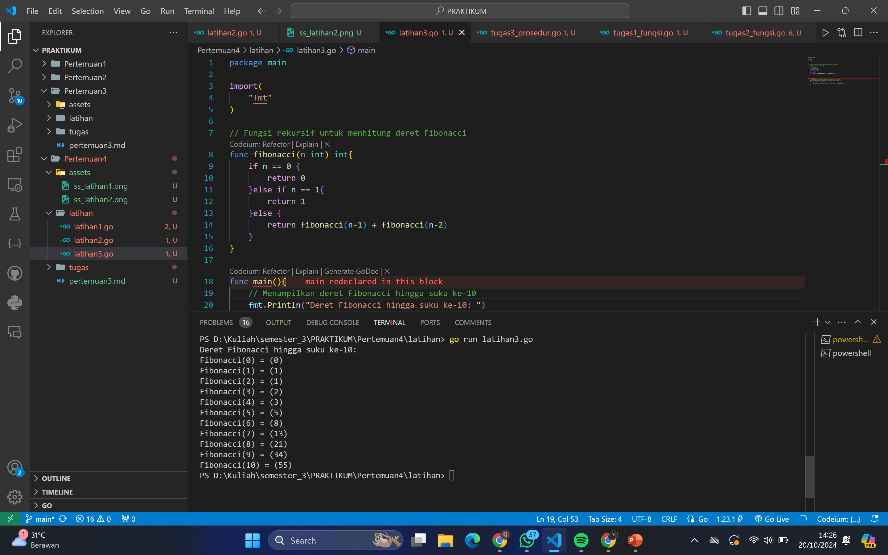
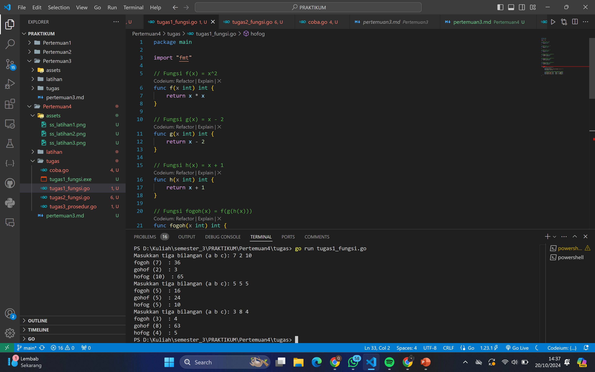
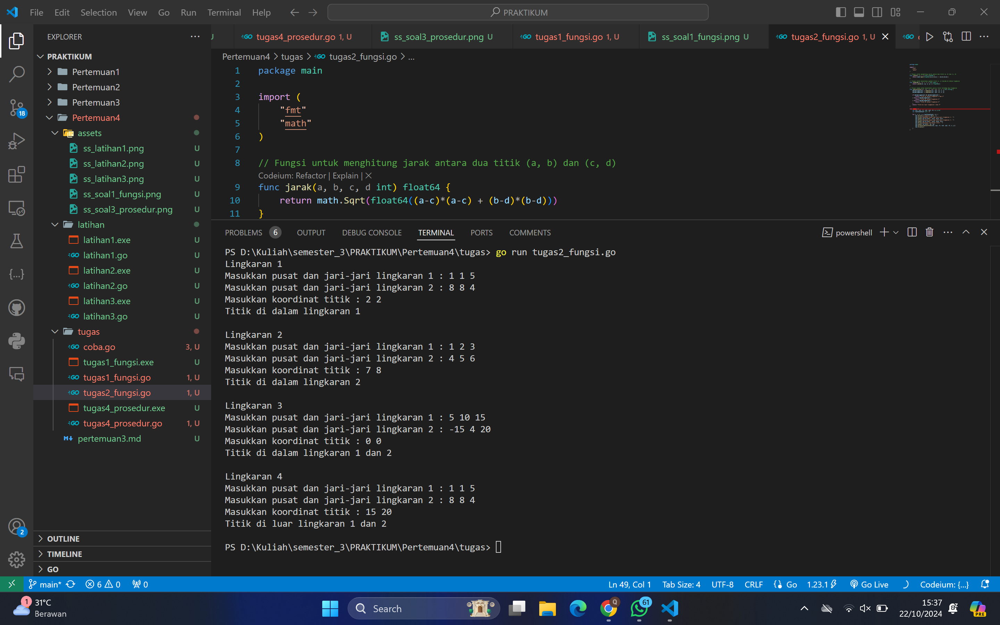
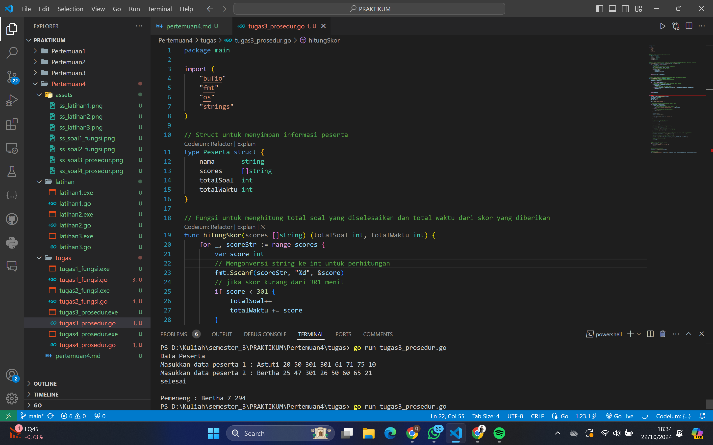
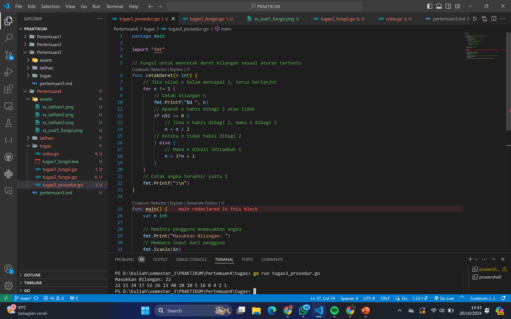

# <h1 align="center">Laporan Praktikum Modul 4-Fungsi & Prosedur</h1>

<h1 align="center">QONITA RAHAYU ATMI-2311102128</h1>

<h1>A. Soal Latihan</h1>

### 1. Soal Latihan 1

```go
package main

import (
	"fmt"
)

func main (){
	var a, b int
	fmt.Scan(&a, &b)
	if a >=b{
		fmt.Println(permutasi(a, b))
	}else{
		fmt.Println(permutasi(b, a))
	}
}

func faktorial(n int) int{
	var hasil int = 1
	var i int
	for i = 1; i <= n; i++{
		hasil = hasil * i
	}
	return hasil
}
func permutasi(n, r int)int {
	return faktorial(n) / faktorial(n-r)
}
```

### Output Screenshot:



### 2. Soal Latihan 2

```go
package main

import (
	"fmt"
)

// Fungsi untuk menghitung faktorial
func factorial(n int) int {
	if n == 0 || n == 1{
		return 1
	}
	result := 1
	for i := 2; i <= n; i++ {
		result *= i
	}
	return result
}

// Fungsi untuk menghitung permutasi
func permutation(n, r int) int {
	return factorial(n) / factorial(n-r)
}

// Fungsi untung mengitung kombinasi
func combination(n, r int) int {
	return factorial(n) / (factorial(r) * factorial(n-r))
}

func main() {
	var a, b, c, d int

	// Meminta input dan output
	fmt.Println("Masukkan nilai a, b, c, d: ")
	fmt.Scan(&a, &b, &c, &d)

	// Menghitung permutasi dan kombinasi untuk a terhadap b
	p1 := permutation(a, c)
	c1 := combination(a, c)

	// Menghitung permutasi dan kombinasi untuk c terhadap d
	p2 := permutation(b, d)
	c2 := combination(b, d)

	// Output hasil
	fmt.Printf("P(%d,%d) = %d\n", a, c, p1)
	fmt.Printf("C(%d,%d) = %d\n", a, c, c1)
	fmt.Printf("P(%d,%d) = %d\n", b, d, p2)
	fmt.Printf("C(%d,%d) = %d\n", b, d, c2)
}
```

### Output Screenshot:



### 3. Soal Latihan 3

```go
package main

import(
	"fmt"
)

// Fungsi rekursif untuk menhitung deret Fibonacci
func fibonacci(n int) int{
	if n == 0 {
		return 0
	}else if n == 1{
		return 1
	}else {
		return fibonacci(n-1) + fibonacci(n-2)
	}
}

func main(){
	// Menampilkan deret Fibonacci hingga suku ke-10
	fmt.Println("Deret Fibonacci hingga suku ke-10: ")
	for i := 0; i <= 10; i++ {
		fmt.Printf("Fibonacci(%d) = (%d)\n", i, fibonacci(i))
	}
}
```

### Output Screenshot:



<h1>B. Tugas</h1>

### 1. Tugas Soal 2 Fungsi

```go
package main

import "fmt"

// Fungsi f(x) = x^2
func f(x int) int {
	return x * x
}

// Fungsi g(x) = x - 2
func g(x int) int {
	return x - 2
}

// Fungsi h(x) = x + 1
func h(x int) int {
	return x + 1
}

// Fungsi fogoh(x) = f(g(h(x)))
func fogoh(x int) int {
	return f(g(h(x)))
}

// Fungsi gohof(x) = g(h(f(x)))
func gohof(x int) int {
	return g(h(f(x)))
}

// Fungsi hofog(x) = h(f(g(x)))
func hofog(x int) int {
	return h(f(g(x)))
}

func main() {
	for i := 1; i <= 3; i++ {
		var a, b, c int
		fmt.Print("Masukkan tiga bilangan (a b c): ")
		fmt.Scan(&a, &b, &c)

		// Cetak hasil sesuai dengan komposisi fungsi
		fmt.Printf("fogoh (%d)  : %d\n", a, fogoh(a))
		fmt.Printf("gohof (%d)  : %d\n", b, gohof(b))
		fmt.Printf("hofog (%d)  : %d\n", c, hofog(c))
	}
}
```

### Output Screenshot:




### 2. Tugas Soal 3 Fungsi

```go
package main

import (
	"fmt"
	"math"
)

// Fungsi untuk menghitung jarak antara dua titik (a, b) dan (c, d)
func jarak(a, b, c, d int) float64 {
	return math.Sqrt(float64((a-c)*(a-c) + (b-d)*(b-d)))
}

// Fungsi untuk menentukan apakah titik (x, y) berada di dalam lingkaran
func didalam(cx, cy, r, x, y int) bool {
	return jarak(cx, cy, x, y) <= float64(r)
}

// Fungsi utama untuk menentukan posisi titik terhadap dua lingkaran
func posisiTitik(cx1, cy1, r1, cx2, cy2, r2, x, y int) string {
	dalamLingkaran1 := didalam(cx1, cy1, r1, x, y)
	dalamLingkaran2 := didalam(cx2, cy2, r2, x, y)

	if dalamLingkaran1 && dalamLingkaran2 {
		return "Titik di dalam lingkaran 1 dan 2"
	} else if dalamLingkaran1 {
		return "Titik di dalam lingkaran 1"
	} else if dalamLingkaran2 {
		return "Titik di dalam lingkaran 2"
	}
	return "Titik di luar lingkaran 1 dan 2"
}

func main() {
	var cx1, cy1, r1, cx2, cy2, r2, x, y int
	var testCaseCount int = 4

	for i := 1; i <= testCaseCount; i++ {
		fmt.Printf("Lingkaran %d\n", i)
		fmt.Print("Masukkan pusat dan jari-jari lingkaran 1 : ")
		fmt.Scanf("%d %d %d\n", &cx1, &cy1, &r1)
		fmt.Print("Masukkan pusat dan jari-jari lingkaran 2 : ")
		fmt.Scanf("%d %d %d\n", &cx2, &cy2, &r2)
		fmt.Print("Masukkan koordinat titik : ")
		fmt.Scanf("%d %d\n", &x, &y)
		fmt.Println(posisiTitik(cx1, cy1, r1, cx2, cy2, r2, x, y))
		fmt.Println() 
	}
}
```

### Output Screenshot:




### 3. Tugas Soal 2 Prosedur

```go
package main

import (
	"bufio"
	"fmt"
	"os"
	"strings"
)

// Struct untuk menyimpan informasi peserta
type Peserta struct {
	nama       string
	scores     []string 
	totalSoal  int
	totalWaktu int
}

// Fungsi untuk menghitung total soal yang diselesaikan dan total waktu dari skor yang diberikan
func hitungSkor(scores []string) (totalSoal int, totalWaktu int) {
	for _, scoreStr := range scores {
		var score int
		// Mengonversi string ke int untuk perhitungan
		fmt.Sscanf(scoreStr, "%d", &score) 
		// jika skor kurang dari 301 menit
		if score < 301 {
			totalSoal++
			totalWaktu += score
		}
	}
	return totalSoal, totalWaktu
}

// Fungsi untuk menentukan pemenang berdasarkan jumlah soal dan total waktu
func cariPemenang(peserta []Peserta) Peserta {
	// Inisialisasi pemenang dengan peserta pertama
	pemenang := peserta[0]

	for _, p := range peserta[1:] {
		// Pemenang ditentukan dari jumlah soal yang lebih banyak
		if p.totalSoal > pemenang.totalSoal {
			pemenang = p
			// Jika soal sama, cek total waktu
		} else if p.totalSoal == pemenang.totalSoal && p.totalWaktu < pemenang.totalWaktu {
			pemenang = p
		}
	}

	return pemenang
}

func main() {
	scanner := bufio.NewScanner(os.Stdin)
	var peserta []Peserta
	pesertaKe := 1
	maxPeserta := 3

	fmt.Println("Data Peserta ")

	// Input untuk diulang hingga maksimal peserta ke-3
	for pesertaKe <= maxPeserta {
		if pesertaKe < maxPeserta {
			// untuk menampilkan hanya untuk peserta 1 dan 2
			fmt.Printf("Masukkan data peserta %d : ", pesertaKe)
		} else {
			// Tidak menampilkan saat peserta ke-3
			fmt.Print("")
		}

		scanner.Scan()
		line := scanner.Text()

		if strings.ToLower(line) == "selesai" {
			break
		}

		// Split data input per peserta
		data := strings.Fields(line)

		// untuk ambil data nama peserta
		nama := data[0]

		// untuk menyimpan skor sebagai string
		var scores []string
		for _, s := range data[1:] {
			// Menyimpan skor sebagai string langsung
			scores = append(scores, s)
		}

		// untuk menghitung total soal yang diselesaikan dan total waktu yang dibutuhkan
		totalSoal, totalWaktu := hitungSkor(scores)

		// untuk menambahkan peserta ke list peserta
		peserta = append(peserta, Peserta{nama, scores, totalSoal, totalWaktu})

		// Increment nomor peserta
		pesertaKe++
	}

	// Jika tidak ada peserta, keluar
	if len(peserta) == 0 {
		fmt.Println("Tidak ada peserta.")
		return
	}

	// untuk mencari pemenang
	pemenang := cariPemenang(peserta)

	// Output hasil
	fmt.Printf("\nPemeneng : %s %d %d\n", pemenang.nama, pemenang.totalSoal, pemenang.totalWaktu)
}
```

### Output Screenshot:




### 4. Tugas Soal 3 Prosedur

```go
package main

import "fmt"

// Fungsi untuk mencetak deret bilangan sesuai aturan tertentu
func cetakDeret(n int) {
    // Jika nilai n belum mencapai 1, terus berlanjut
    for n != 1 {
        // Cetak bilangan n
        fmt.Printf("%d ", n) 
        // Apakah n habis dibagi 2 atau tidak
        if n%2 == 0 { 
            // Jika n habis dibagi 2, maka n dibagi 2   
            n = n / 2
        // Ketika n tidak habis dibagi 2
        } else { 
            // Maka n dikali 3ditambah 1
            n = 3*n + 1
        }
    }
    // Cetak angka terakhir yaitu 1
    fmt.Printf("1\n") 
}

func main() {
    var n int

    // Meminta pengguna memasukkan angka
    fmt.Print("Masukkan Bilangan: ")
    // Membaca input dari pengguna
    fmt.Scanln(&n) 

    // Ketika n lebih besar dari 0 dan n kurang dari 1 juta maka melakukan fungsi cetak deret
    if n > 0 && n < 1000000 {
        cetakDeret(n) 
    } else {
        fmt.Println("Bilangan harus lebih kecil dari 1000000 dan bilangan positif.") 
    }
}
```

### Output Screenshot:


