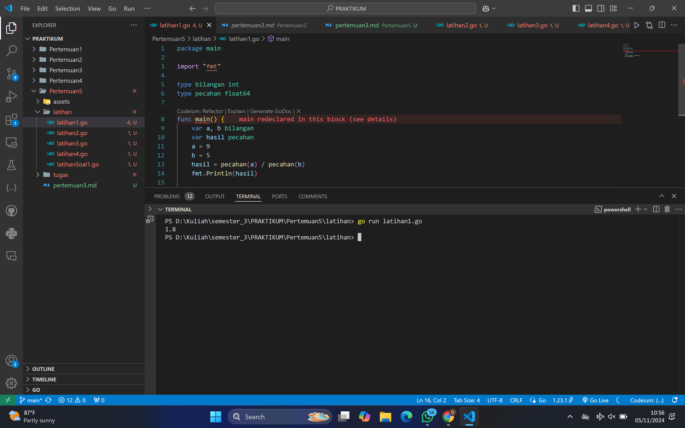
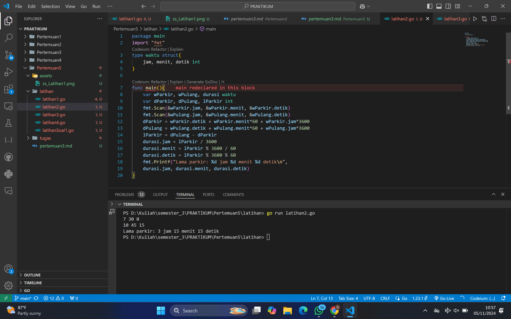
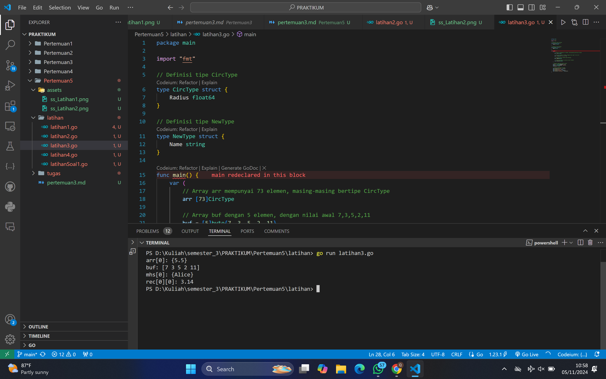
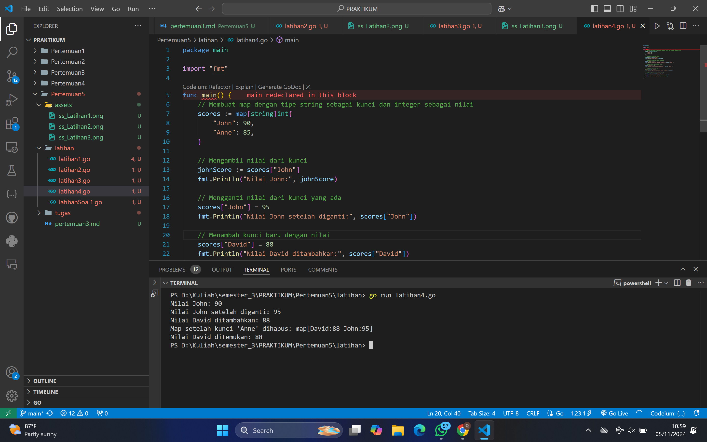
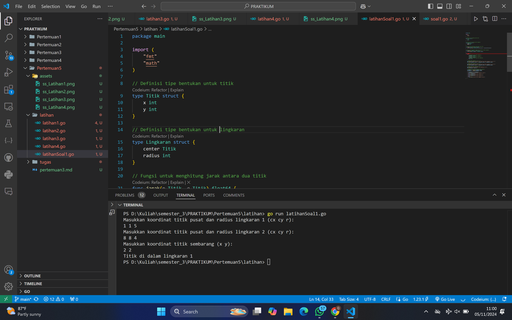
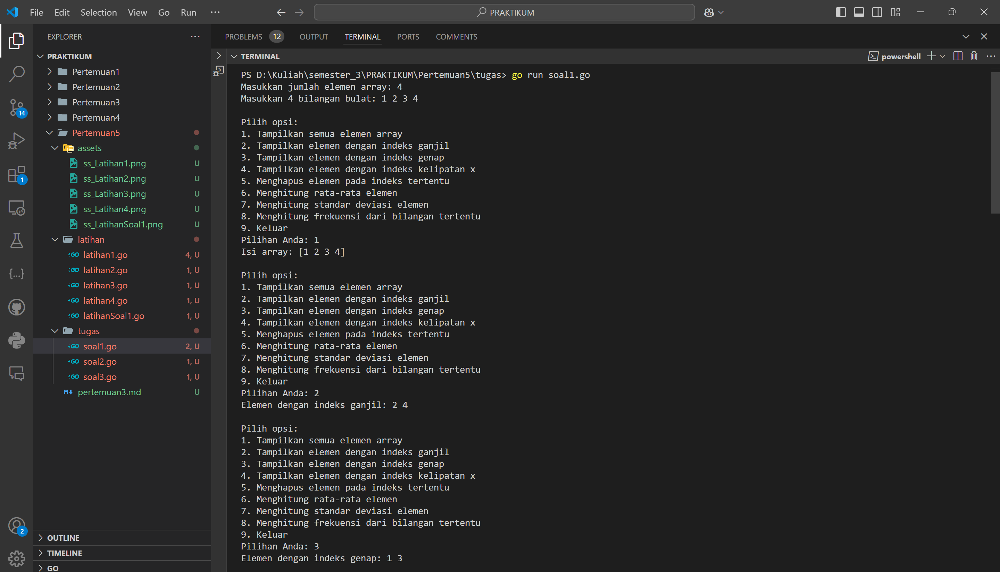
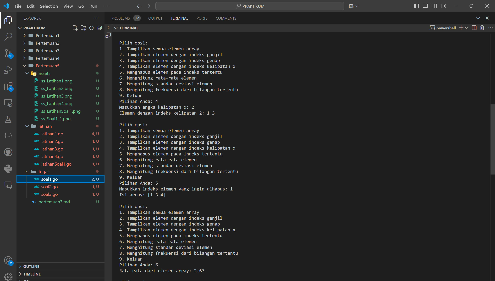
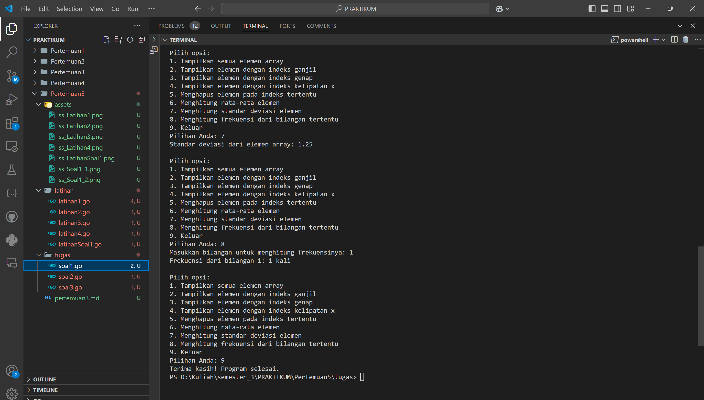
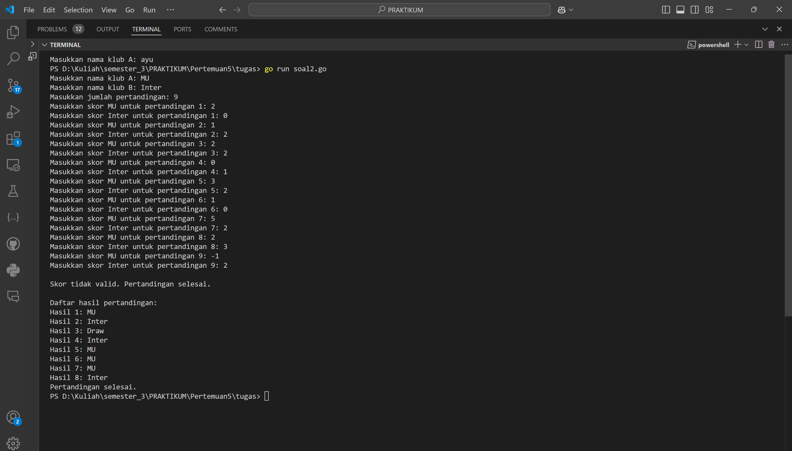
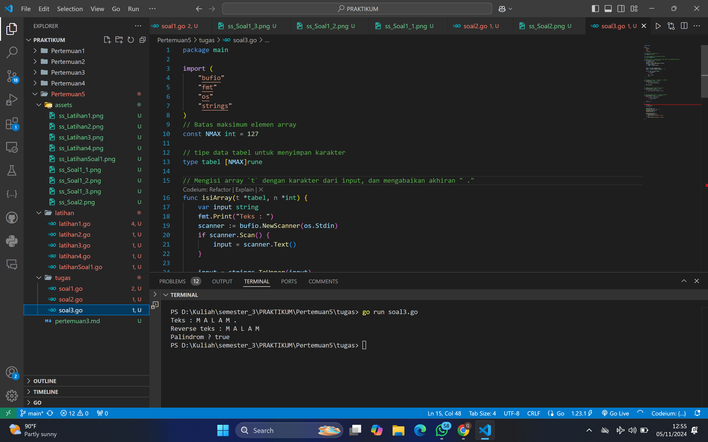

# <h1 align="center">Laporan Praktikum Modul 7-Struck & Array</h1>

<h1 align="center">QONITA RAHAYU ATMI-2311102128</h1>

<h1>A. Soal Latihan</h1>

### 1. Latihan 1

```go
package main

import "fmt"

type bilangan int
type pecahan float64

func main() {
	var a, b bilangan
	var hasil pecahan
	a = 9
	b = 5
	hasil = pecahan(a) / pecahan(b)
	fmt.Println(hasil)

}
```

### Output Screenshot:



### 2. Latihan 2

```go
package main
import "fmt"
type waktu struct{
	jam, menit, detik int
}

func main(){
	var wParkir, wPulang, durasi waktu
	var dParkir, dPulang, lParkir int
	fmt.Scan(&wParkir.jam, &wParkir.menit, &wParkir.detik)
	fmt.Scan(&wPulang.jam, &wPulang.menit, &wPulang.detik)
	dParkir = wParkir.detik + wParkir.menit*60 + wParkir.jam*3600
	dPulang = wPulang.detik + wPulang.menit*60 + wPulang.jam*3600
	lParkir = dPulang - dParkir
	durasi.jam = lParkir / 3600
	durasi.menit = lParkir % 3600 / 60
	durasi.detik = lParkir % 3600 % 60
	fmt.Printf("Lama parkir: %d jam %d menit %d detik\n", 
	durasi.jam, durasi.menit, durasi.detik)
}
```

### Output Screenshot:



### 3. Latihan 3

```go
package main

import "fmt"

// Definisi tipe CircType
type CircType struct {
	Radius float64
}

// Definisi tipe NewType
type NewType struct {
	Name string
}

func main() {
	var (
		// Array arr mempunyai 73 elemen, masing-masing bertipe CircType
		arr [73]CircType

		// Array buf dengan 5 elemen, dengan nilai awal 7,3,5,2,11
		buf = [5]byte{7, 3, 5, 2, 11}

		// Array mhs berisi 2000 elemen NewType
		mhs [2000]NewType

		// Array dua dimensi rec berisi nilai float64
		rec [20][40]float64
	)

	// Mengisi beberapa elemen contoh
	arr[0] = CircType{Radius: 5.5}
	mhs[0] = NewType{Name: "Alice"}
	rec[0][0] = 3.14

	// Contoh penggunaan variabel
	fmt.Println("arr[0]:", arr[0])
	fmt.Println("buf:", buf)
	fmt.Println("mhs[0]:", mhs[0])
	fmt.Println("rec[0][0]:", rec[0][0])
}
```

### Output Screenshot:



### 4. Latihan 4

```go
package main

import "fmt"

func main() {
	// Membuat map dengan tipe string sebagai kunci dan integer sebagai nilai
	scores := map[string]int{
		"John": 90,
		"Anne": 85,
	}

	// Mengambil nilai dari kunci
	johnScore := scores["John"]
	fmt.Println("Nilai John:", johnScore)

	// Mengganti nilai dari kunci yang ada
	scores["John"] = 95
	fmt.Println("Nilai John setelah diganti:", scores["John"])

	// Menambah kunci baru dengan nilai
	scores["David"] = 88
	fmt.Println("Nilai David ditambahkan:", scores["David"])

	// Menghapus kunci dari map
	delete(scores, "Anne")
	fmt.Println("Map setelah kunci 'Anne' dihapus:", scores)

	// Mengecek apakah kunci ada dalam map
	if score, ada := scores["David"]; ada {
		fmt.Println("Nilai David ditemukan:", score)
	} else {
		fmt.Println("Nilai David tidak ditemukan")
	}
}
```

### Output Screenshot:



### 5. Soal Latihan 1

```go
package main

import (
	"fmt"
	"math"
)

// Definisi tipe bentukan untuk titik
type Titik struct {
	x int
	y int
}

// Definisi tipe bentukan untuk lingkaran
type Lingkaran struct {
	center Titik
	radius int
}

// Fungsi untuk menghitung jarak antara dua titik
func jarak(p Titik, q Titik) float64 {
	return math.Sqrt(float64((p.x-q.x)*(p.x-q.x) + (p.y-q.y)*(p.y-q.y)))
}

// Fungsi untuk menentukan apakah titik berada di dalam lingkaran
func didalam(c Lingkaran, p Titik) bool {
	return jarak(p, c.center) < float64(c.radius)
}

func main() {
	var (
		// Mengambil input untuk lingkaran 1
		lingkaran1 Lingkaran
		// Mengambil input untuk lingkaran 2
		lingkaran2 Lingkaran
		// Mengambil input untuk titik sembarang
		point Titik
	)

	// Input untuk lingkaran 1 (cx, cy, r)
	fmt.Println("Masukkan koordinat titik pusat dan radius lingkaran 1 (cx cy r):")
	fmt.Scan(&lingkaran1.center.x, &lingkaran1.center.y, &lingkaran1.radius)

	// Input untuk lingkaran 2 (cx, cy, r)
	fmt.Println("Masukkan koordinat titik pusat dan radius lingkaran 2 (cx cy r):")
	fmt.Scan(&lingkaran2.center.x, &lingkaran2.center.y, &lingkaran2.radius)

	// Input untuk titik sembarang (x, y)
	fmt.Println("Masukkan koordinat titik sembarang (x y):")
	fmt.Scan(&point.x, &point.y)

	// Mengecek posisi titik terhadap kedua lingkaran
	inLingkaran1 := didalam(lingkaran1, point)
	inLingkaran2 := didalam(lingkaran2, point)

	if inLingkaran1 && inLingkaran2 {
		fmt.Println("Titik di dalam lingkaran 1 dan 2")
	} else if inLingkaran1 {
		fmt.Println("Titik di dalam lingkaran 1")
	} else if inLingkaran2 {
		fmt.Println("Titik di dalam lingkaran 2")
	} else {
		fmt.Println("Titik di luar lingkaran 1 dan 2")
	}
}
```

### Output Screenshot:



<h1>B. Tugas</h1>

### 1. Tugas Soal 2 

```go
package main

import (
	"fmt"
	"math"
)

// Fungsi untuk menampilkan semua elemen dari array
func tampilkanArray(arr []int) {
	fmt.Println("Isi array:", arr)
}

// Fungsi untuk menampilkan elemen dengan indeks ganjil
func tampilkanIndeksGanjil(arr []int) {
	fmt.Print("Elemen dengan indeks ganjil: ")
	for i := 1; i < len(arr); i += 2 {
		fmt.Print(arr[i], " ")
	}
	fmt.Println()
}

// Fungsi untuk menampilkan elemen dengan indeks genap
func tampilkanIndeksGenap(arr []int) {
	fmt.Print("Elemen dengan indeks genap: ")
	for i := 0; i < len(arr); i += 2 {
		fmt.Print(arr[i], " ")
	}
	fmt.Println()
}

// Fungsi untuk menampilkan elemen dengan indeks kelipatan x
func tampilkanKelipatanX(arr []int, x int) {
	fmt.Print("Elemen dengan indeks kelipatan ", x, ": ")
	for i := 0; i < len(arr); i++ {
		if i%x == 0 {
			fmt.Print(arr[i], " ")
		}
	}
	fmt.Println()
}

// Fungsi untuk menghapus elemen pada indeks tertentu
func hapusElemen(arr []int, indeks int) []int {
	return append(arr[:indeks], arr[indeks+1:]...)
}

// Fungsi untuk menghitung rata-rata elemen dalam array
func hitungRataRata(arr []int) float64 {
	total := 0
	for _, nilai := range arr {
		total += nilai
	}
	return float64(total) / float64(len(arr))
}

// Fungsi untuk menghitung standar deviasi
func hitungStandarDeviasi(arr []int) float64 {
	rataRata := hitungRataRata(arr)
	var total float64
	for _, nilai := range arr {
		total += math.Pow(float64(nilai)-rataRata, 2)
	}
	return math.Sqrt(total / float64(len(arr)))
}

// Fungsi untuk menghitung frekuensi dari suatu bilangan tertentu
func hitungFrekuensi(arr []int, bilangan int) int {
	jumlah := 0
	for _, nilai := range arr {
		if nilai == bilangan {
			jumlah++
		}
	}
	return jumlah
}

func main() {
	var N int
	fmt.Print("Masukkan jumlah elemen array: ")
	fmt.Scan(&N)

	arr := make([]int, N)
	fmt.Print("Masukkan ", N, " bilangan bulat: ")
	for i := 0; i < N; i++ {
		fmt.Scan(&arr[i])
	}

	for {
		// Menampilkan menu
		fmt.Println("\nPilih opsi:")
		fmt.Println("1. Tampilkan semua elemen array")
		fmt.Println("2. Tampilkan elemen dengan indeks ganjil")
		fmt.Println("3. Tampilkan elemen dengan indeks genap")
		fmt.Println("4. Tampilkan elemen dengan indeks kelipatan x")
		fmt.Println("5. Menghapus elemen pada indeks tertentu")
		fmt.Println("6. Menghitung rata-rata elemen")
		fmt.Println("7. Menghitung standar deviasi elemen")
		fmt.Println("8. Menghitung frekuensi dari bilangan tertentu")
		fmt.Println("9. Keluar")
		fmt.Print("Pilihan Anda: ")

		var pilihan int
		fmt.Scan(&pilihan)

		switch pilihan {
		case 1:
			tampilkanArray(arr)
		case 2:
			tampilkanIndeksGanjil(arr)
		case 3:
			tampilkanIndeksGenap(arr)
		case 4:
			var x int
			fmt.Print("Masukkan angka kelipatan x: ")
			fmt.Scan(&x)
			tampilkanKelipatanX(arr, x)
		case 5:
			var indeksHapus int
			fmt.Print("Masukkan indeks elemen yang ingin dihapus: ")
			fmt.Scan(&indeksHapus)
			arr = hapusElemen(arr, indeksHapus)
			tampilkanArray(arr)
		case 6:
			rataRata := hitungRataRata(arr)
			fmt.Printf("Rata-rata dari elemen array: %.2f\n", rataRata)
		case 7:
			standarDeviasi := hitungStandarDeviasi(arr)
			fmt.Printf("Standar deviasi dari elemen array: %.2f\n", standarDeviasi)
		case 8:
			var bilangan int
			fmt.Print("Masukkan bilangan untuk menghitung frekuensinya: ")
			fmt.Scan(&bilangan)
			frekuensi := hitungFrekuensi(arr, bilangan)
			fmt.Printf("Frekuensi dari bilangan %d: %d kali\n", bilangan, frekuensi)
		case 9:
			fmt.Println("Terima kasih! Program selesai.")
			return
		default:
			fmt.Println("Pilihan tidak valid, silakan coba lagi.")
		}
	}
}
```

### Output Screenshot:








### 2. Tugas Soal 3

```go
package main

import (
	"fmt"
)

func main() {
	// Deklarasi variabel untuk nama klub
	var klubA, klubB string
	fmt.Print("Masukkan nama klub A: ")
	fmt.Scan(&klubA)
	fmt.Print("Masukkan nama klub B: ")
	fmt.Scan(&klubB)

	// Meminta jumlah pertandingan dari pengguna
	var jumlahPertandingan int
	fmt.Print("Masukkan jumlah pertandingan: ")
	fmt.Scan(&jumlahPertandingan)

	// Untuk menyimpan hasil pertandingan
	var hasil []string
	pertandinganSelesai := false 

	// Untuk memasukkan skor berdasarkan jumlah pertandingan
	for i := 1; i <= jumlahPertandingan; i++ {
		var skorA, skorB int

		fmt.Printf("Masukkan skor %s untuk pertandingan %d: ", klubA, i)
		fmt.Scan(&skorA)
		fmt.Printf("Masukkan skor %s untuk pertandingan %d: ", klubB, i)
		fmt.Scan(&skorB)

		// Mengecek jika skor negatif
		if skorA < 0 || skorB < 0 {
			fmt.Println("\nSkor tidak valid. Pertandingan selesai.")
			pertandinganSelesai = true
			break 
		}

		// Menentukan pemenang berdasarkan skor
		if skorA > skorB {
			hasil = append(hasil, klubA)
		} else if skorB > skorA {
			hasil = append(hasil, klubB)
		} else {
			hasil = append(hasil, "Draw")
		}
	}

	// Menampilkan hasil pertandingan yang valid sebelum skor negatif
	fmt.Println("\nDaftar hasil pertandingan:")
	for i, winner := range hasil {
		if winner == "Draw" {
			fmt.Printf("Hasil %d: Draw\n", i+1)
		} else {
			fmt.Printf("Hasil %d: %s\n", i+1, winner)
		}
	}

	// Menampilkan pesan akhir jika pertandingan dihentikan karena skor negatif
	if pertandinganSelesai {
		fmt.Println("Pertandingan selesai.")
	}
}
```

### Output Screenshot:




### 3.  Tugas Soal 4
```go
package main

import (
	"bufio"
	"fmt"
	"os"
	"strings"
)
// Batas maksimum elemen array
const NMAX int = 127 

// tipe data tabel untuk menyimpan karakter
type tabel [NMAX]rune 

// Mengisi array `t` dengan karakter dari input, dan mengabaikan akhiran " ."
func isiArray(t *tabel, n *int) {
	var input string
	fmt.Print("Teks : ")
	scanner := bufio.NewScanner(os.Stdin)
	if scanner.Scan() {
		input = scanner.Text()
	}

	input = strings.ToUpper(input)   
	input = strings.TrimSuffix(input, " .") 

	for i, char := range input {
		if i >= NMAX {
			break
		}
		t[i] = char
		*n++
	}
}

// Mencetak isi array `t` sebanyak `n` karakter
func cetakArray(t tabel, n int) {
	for i := 0; i < n; i++ {
		fmt.Print(string(t[i]))
	}
	fmt.Println()
}

// Membalik urutan elemen dalam array `t`
func balikanArray(t *tabel, n int) {
	for i := 0; i < n/2; i++ {
		t[i], t[n-i-1] = t[n-i-1], t[i]
	}
}

// Memeriksa apakah array `t` adalah palindrom
func palindrome(t tabel, n int) bool {
	for i := 0; i < n/2; i++ {
		if t[i] != t[n-i-1] {
			return false
		}
	}
	return true
}

func main() {
	var tab tabel
	var n int

	isiArray(&tab, &n)
	fmt.Print("Reverse teks : ")
	balikanArray(&tab, n)
	cetakArray(tab, n)

	balikanArray(&tab, n)
	if palindrome(tab, n) {
		fmt.Println("Palindrom ? true")
	} else {
		fmt.Println("Palindrom ? false")
	}
}
```

### Output Screenshot:


