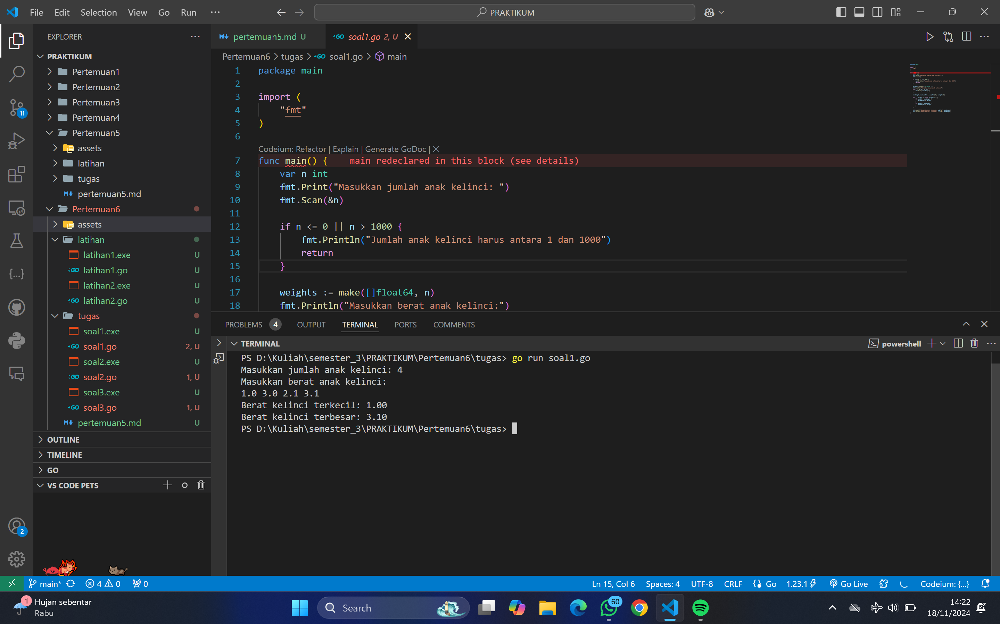
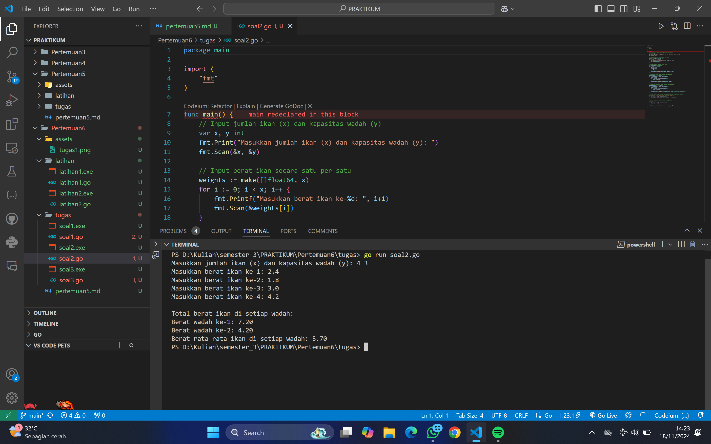
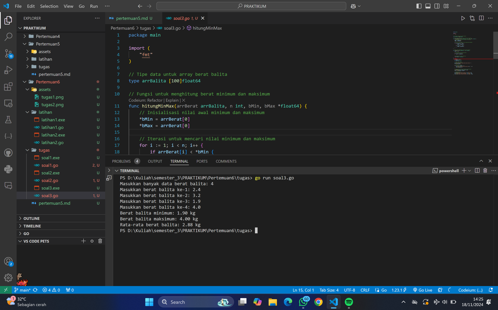

# <h1 align="center">Laporan Praktikum Modul 10-PENCARIAN NILAI EKSTRIM PADA HIMPUNAN DATA</h1>

<h1 align="center">QONITA RAHAYU ATMI-2311102128</h1>

<h1>A. Soal Latihan</h1>

### 1. Latihan 1

```go
package main

import (
	"fmt"
)

type arrInt [2023]int

// Fungsi untuk mencari indeks dari nilai terkecil
func terkecil_2(tabInt arrInt, n int) int {
	var idx int = 0 // indeks data pertama
	var j int = 1   // pencarian dimulai dari data kedua
	for j < n {
		if tabInt[idx] > tabInt[j] { // cek apakah tabInt[j] lebih kecil dari tabInt[idx]
			idx = j // update idx ke indeks baru yang nilainya lebih kecil
		}
		j = j + 1
	}
	return idx // mengembalikan indeks dari nilai terkecil
}

func main() {
	var n int
	var data arrInt

	// Input jumlah elemen N
	fmt.Print("Masukkan jumlah elemen (N <= 2023): ")
	fmt.Scan(&n)

	// Validasi N agar tidak melebihi kapasitas array
	if n <= 0 || n > 2023 {
		fmt.Println("Jumlah elemen harus antara 1 dan 2023")
		return
	}

	// Input elemen-elemen array
	fmt.Println("Masukkan elemen array:")
	for i := 0; i < n; i++ {
		fmt.Scan(&data[i])
	}

	// Panggil fungsi untuk mencari indeks nilai terkecil
	idxTerkecil := terkecil_2(data, n)
	fmt.Printf("Indeks nilai terkecil: %d\n", idxTerkecil)
	fmt.Printf("Nilai terkecil: %d\n", data[idxTerkecil])
}
```

### Output Screenshot:


### 2. Latihan 2

```go
package main

import (
	"fmt"
)

// Mendefinisikan tipe data mahasiswa
type mahasiswa struct {
	nama, nim, kelas, jurusan string
	ipk                       float64
}

// Mendefinisikan array mahasiswa dengan kapasitas 2023
type arrMhs [2023]mahasiswa

// Fungsi untuk mencari indeks mahasiswa dengan IPK tertinggi
func IPK_2(T arrMhs, n int) int {
	// idx menyimpan indeks mahasiswa dengan IPK tertinggi sementara
	var idx int = 0
	var j int = 1
	for j < n {
		if T[idx].ipk < T[j].ipk {
			idx = j
		}
		j = j + 1
	}
	return idx
}

func main() {
	var n int
	var data arrMhs

	// Input jumlah mahasiswa
	fmt.Print("Masukkan jumlah mahasiswa (N <= 2023): ")
	fmt.Scan(&n)

	// Validasi jumlah mahasiswa
	if n <= 0 || n > 2023 {
		fmt.Println("Jumlah mahasiswa harus antara 1 dan 2023")
		return
	}

	// Input data mahasiswa
	for i := 0; i < n; i++ {
		fmt.Printf("Masukkan data mahasiswa ke-%d\n", i+1)
		fmt.Print("Nama: ")
		fmt.Scan(&data[i].nama)
		fmt.Print("NIM: ")
		fmt.Scan(&data[i].nim)
		fmt.Print("Kelas: ")
		fmt.Scan(&data[i].kelas)
		fmt.Print("Jurusan: ")
		fmt.Scan(&data[i].jurusan)
		fmt.Print("IPK: ")
		fmt.Scan(&data[i].ipk)
	}

	// Panggil fungsi untuk mencari indeks mahasiswa dengan IPK tertinggi
	idxTertinggi := IPK_2(data, n)

	// Tampilkan data mahasiswa dengan IPK tertinggi
	fmt.Println("\nMahasiswa dengan IPK tertinggi:")
	fmt.Printf("Nama    : %s\n", data[idxTertinggi].nama)
	fmt.Printf("NIM     : %s\n", data[idxTertinggi].nim)
	fmt.Printf("Kelas   : %s\n", data[idxTertinggi].kelas)
	fmt.Printf("Jurusan : %s\n", data[idxTertinggi].jurusan)
	fmt.Printf("IPK     : %.2f\n", data[idxTertinggi].ipk)
}
```

### Output Screenshot:


<h1>B. Tugas</h1>

### 1. tugas 1

```go
package main

import (
    "fmt"
)

func main() {
    var n int
    fmt.Print("Masukkan jumlah anak kelinci: ")
    fmt.Scan(&n)

    if n <= 0 || n > 1000 {
        fmt.Println("Jumlah anak kelinci harus antara 1 dan 1000")
        return
    }

    weights := make([]float64, n)
    fmt.Println("Masukkan berat anak kelinci:")
    for i := 0; i < n; i++ {
        fmt.Scan(&weights[i])
    }

    minWeight, maxWeight := weights[0], weights[0]

    for _, weight := range weights[1:] {
        if weight < minWeight {
            minWeight = weight
        }
        if weight > maxWeight {
            maxWeight = weight
        }
    }

    fmt.Printf("Berat kelinci terkecil: %.2f\n", minWeight)
    fmt.Printf("Berat kelinci terbesar: %.2f\n", maxWeight)
}
```

### Output Screenshot:



### 2. tugas 2

```go
package main

import (
	"fmt"
)

func main() {
	// Input jumlah ikan (x) dan kapasitas wadah (y)
	var x, y int
	fmt.Print("Masukkan jumlah ikan (x) dan kapasitas wadah (y): ")
	fmt.Scan(&x, &y)

	// Input berat ikan secara satu per satu
	weights := make([]float64, x)
	for i := 0; i < x; i++ {
		fmt.Printf("Masukkan berat ikan ke-%d: ", i+1)
		fmt.Scan(&weights[i])
	}

	// Mengelompokkan ikan ke dalam wadah
	var containers [][]float64
	for i := 0; i < x; i += y {
		end := i + y
		if end > x {
			end = x
		}
		containers = append(containers, weights[i:end])
	}

	// Menghitung total berat ikan di setiap wadah
	totalWeights := []float64{}
	for _, container := range containers {
		total := 0.0
		for _, weight := range container {
			total += weight
		}
		totalWeights = append(totalWeights, total)
	}

	// Menghitung rata-rata berat ikan di setiap wadah
	averageWeights := []float64{}
	for _, container := range containers {
		total := 0.0
		for _, weight := range container {
			total += weight
		}
		averageWeights = append(averageWeights, total/float64(len(container)))
	}

	// Output total berat ikan di setiap wadah dengan format yang diminta
	fmt.Println("\nTotal berat ikan di setiap wadah:")
	for i, total := range totalWeights {
		fmt.Printf("Berat wadah ke-%d: %.2f\n", i+1, total)
	}

	// Output rata-rata berat ikan di setiap wadah
	totalSum := 0.0
	for _, total := range totalWeights {
		totalSum += total
	}
	averageTotal := totalSum / float64(len(totalWeights))
	fmt.Printf("Berat rata-rata ikan di setiap wadah: %.2f\n", averageTotal)
}
```

### Output Screenshot:



### 3. tugas 3

```go
package main

import (
	"fmt"
)

// Tipe data untuk array berat balita
type arrBalita [100]float64

// Fungsi untuk menghitung berat minimum dan maksimum
func hitungMinMax(arrBerat arrBalita, n int, bMin, bMax *float64) {
	// Inisialisasi nilai awal minimum dan maksimum
	*bMin = arrBerat[0]
	*bMax = arrBerat[0]

	// Iterasi untuk mencari nilai minimum dan maksimum
	for i := 1; i < n; i++ {
		if arrBerat[i] < *bMin {
			*bMin = arrBerat[i]
		}
		if arrBerat[i] > *bMax {
			*bMax = arrBerat[i]
		}
	}
}

// Fungsi untuk menghitung rata-rata berat balita
func rerata(arrBerat arrBalita, n int) float64 {
	total := 0.0

	// Menjumlahkan semua berat balita
	for i := 0; i < n; i++ {
		total += arrBerat[i]
	}

	// Mengembalikan hasil rata-rata
	return total / float64(n)
}

func main() {
	var berat arrBalita    
	var jumlah int         
	var min, max float64   
	
	// Input jumlah balita
	fmt.Print("Masukkan banyak data berat balita: ")
	fmt.Scan(&jumlah)

	// Input berat balita
	for i := 0; i < jumlah; i++ {
		fmt.Printf("Masukkan berat balita ke-%d: ", i+1)
		fmt.Scan(&berat[i])
	}

	// Hitung nilai minimum, maksimum, dan rata-rata
	hitungMinMax(berat, jumlah, &min, &max)
	rata := rerata(berat, jumlah)

	// Tampilkan hasil
	fmt.Printf("Berat balita minimum: %.2f kg\n", min)
	fmt.Printf("Berat balita maksimum: %.2f kg\n", max)
	fmt.Printf("Rata-rata berat balita: %.2f kg\n", rata)
}
```

### Output Screenshot:


